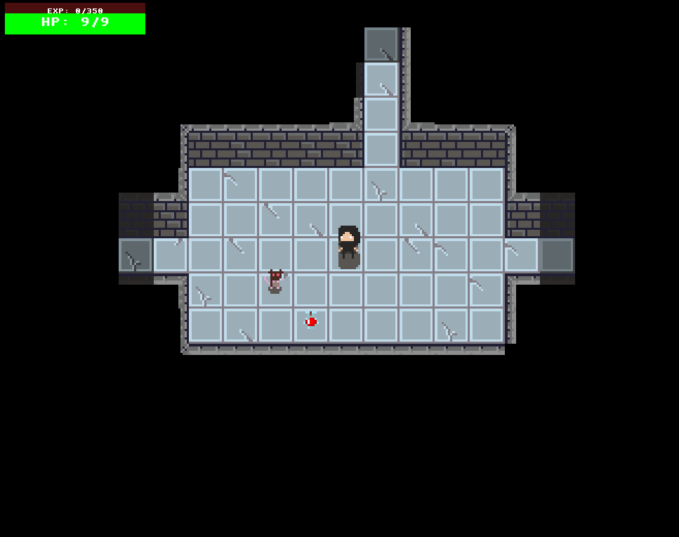
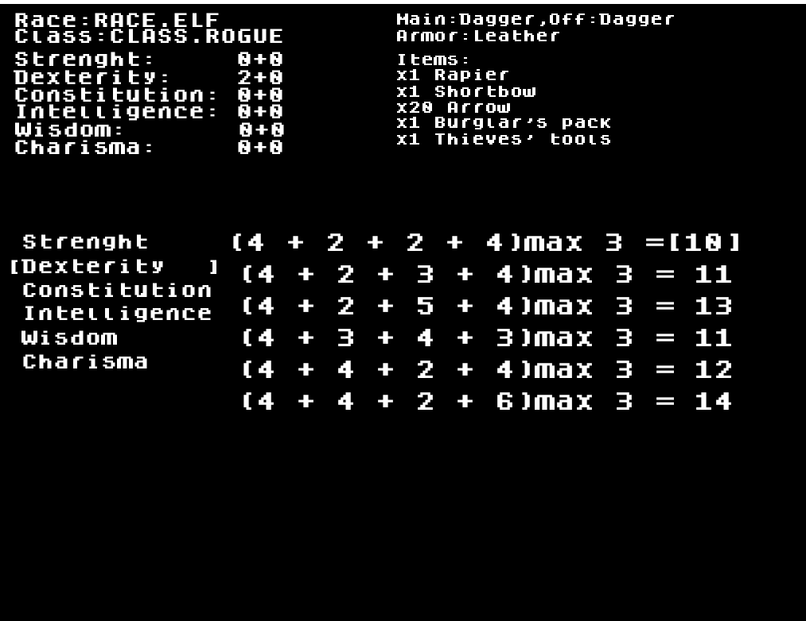

# Danger Dagger

### Description
The main assumption is to make a game that:
- make possibility to play for 4 players
- be a  turn-based game 
- be online multiplayer game 
- be bassed on the classic "roguelike" game and D&D 5e

## Stages:

1. Base game:
   1. For 1 player 
   2. Base combat only on colision
   3. Base spell with "spell scrole" (* with mouse use)
   4. Base state system 
      1. Str - Power
      2. Dex - Agility
      3. Con - Constitution
      4. Int - Intelligence
      5. Wis - Wisdom
      6. Cha - Charisma  
   5. Base item system
   6. Base Equpment system
   7. Monser with a* ai
   8. Fov map
   9. Self generate map
   10. Inventory menu (text only)
   11. Player stats (text only)
   12. Grafic with simple pixel art
   13. Mini-map
   14. Xml based GUI
   15. Database 
   16. Character creator.

2. Final game:
   1. For 4 players (online/lan) by one is host rest can join by IP
   2. Range and Male combat
   3. 5 type of class (ready 12 classes)
   4. More complex state system
   5. Item generic that are saved on Database (work in proggres)
   6. Monsert generic that are saved on Database (work in proggres)
   7. Better Self generate map 
      1. Biger then window screen
      2. Mix algotytms for more dynamic game
      3. Bioms
      4. Boss rooms
      5. Trap rooms
      6. Treasure rooms
   8. Monsert drop items
   9. Inventory menu with sprites
   10. Monsert and Players with sprites (for all type and class) (work in progress)
   11. Player stats menu with sprites
   12. Animations
   13. Bosses
   14. Rare Items
   15. Eq and weapon wear (+ fix items)

## Bugs:
1. Pressed event don't work ..;/ moving by taping buttons.
2. Tile rules still buget

3. Set abillity in character creator something not right...
